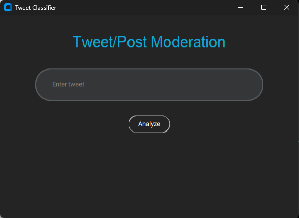
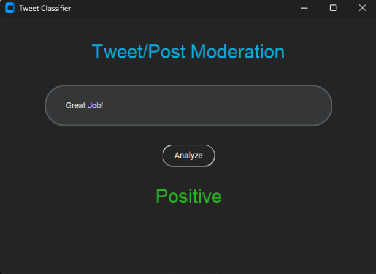
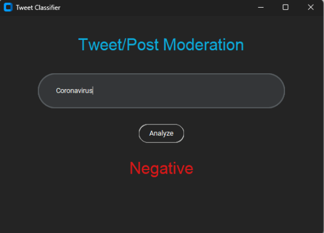

# Twitter-Censorship-Application
## An application that will determine whether a tweet is positive, negative, or neutral using an AI model (roBERTa).
### Application made using Python, Tkinter, and preprogrammed AI model.

  

#### Positive Tweet

  

#### Negative Tweet

  

